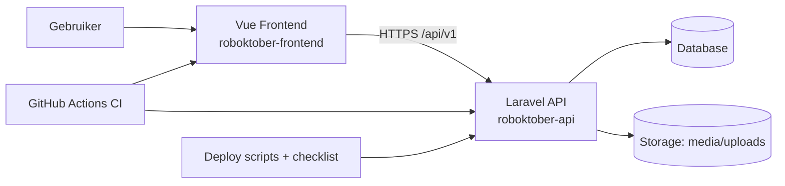
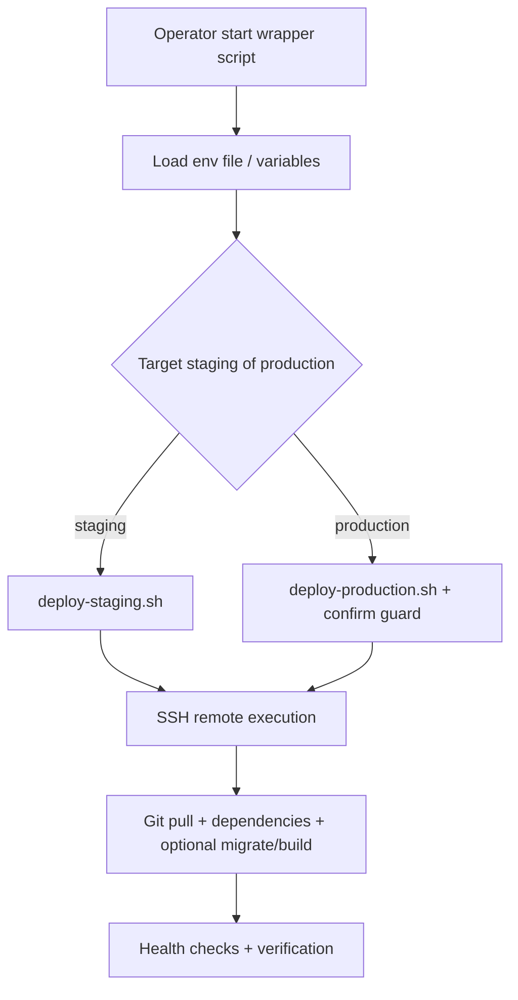

# Architectuurdocument Roboktober

## 1. Doel en Scope
Dit document beschrijft de huidige en gewenste architectuur van het Roboktober-platform.

Scope:
- Backend API en admin in Laravel (`roboktober-api`)
- Frontend applicatie in Vue 3 (`roboktober-frontend`)
- Build, quality-gates en deployment (`.github/workflows`, `deploy`)

Doelen:
- Duidelijke scheiding van verantwoordelijkheden (SOLID als richtlijn)
- Veilige standaardinstellingen voor auth, input en deployment
- Voorspelbare kwaliteit via tests en static analysis
- Eenvoudige operationele overdracht (runbooks/checklists)

## 2. Architectuuroverzicht
Het platform volgt een gescheiden frontend/backend opzet met een API-gedreven integratie.

Kernprincipes:
- Frontend rendert UI en orkestreert interactie.
- Backend beheert domeinlogica, validatie, authorisatie en data-integriteit.
- CI afdwingt codekwaliteit en regressiecontrole.
- Deployment gebruikt expliciete veiligheidsstappen voor productie.

## 3. Backend Architectuur (Laravel)
Map: `roboktober-api`

### 3.1 Lagen
- HTTP-laag:
  - Controllers in `app/Http/Controllers`
  - FormRequest-validatie in `app/Http/Requests`
  - API Resources in `app/Http/Resources`
- Domein/data-laag:
  - Eloquent modellen in `app/Models`
  - Enums in `app/Enums`
  - Concerns in `app/Concerns`
- Platform/integratie-laag:
  - Mailers in `app/Mail`
  - Providers/config in `app/Providers` en `config`

Gewenste verantwoordelijkheden:
- Controller: alleen orchestration (request -> service/use-case -> response)
- FormRequest: input validatie + normalisatie
- Model: domeinregels dicht bij data (maar geen UI/HTTP kennis)
- Resource: API-presentatie en serialisatie

### 3.2 Routing
- Publieke/web routes: `routes/web.php`
- API routes: `routes/api.php`
- Console routes: `routes/console.php`

Versiestrategie:
- API is gesegmenteerd per versie (`Api/V1` namespaces)
- Nieuwe breaking changes gaan via nieuwe API-versie

### 3.3 Data en relaties
- Eloquent modellen representeren kernentiteiten (zoals teams, battles, media, links)
- Migrations beheren schema-evolutie
- Factories/seeders voor reproduceerbare test- en demo-data

Dataprincipes:
- Constraints eerst in database, daarna in applicatielogica
- Nullability expliciet en consistent in model/resource contracten
- Typeveiligheid via PHPStan/Larastan en strikte phpdoc waar relevant

## 4. Frontend Architectuur (Vue 3 + TypeScript)
Map: `roboktober-frontend`

### 4.1 Opbouw
- Bootstrap: `src/main.ts`
- Root app: `src/App.vue`
- Routing: `src/router`
- UI bouwstenen: `src/components`
- Views/pagina's: `src/views`
- API client/logica: `src/api`
- Herbruikbare state/logic hooks: `src/composables`
- Domeintypes: `src/types`

### 4.2 Richtlijnen
- Views zijn dun: composables + API modules dragen de logica
- Typescript types zijn leidend voor contracten
- API-fouten worden uniform afgehandeld richting UI
- Geen businessregels dupliceren die al op backend afgedwongen zijn

### 4.3 Integratie met backend
- Communicatie via versieerde endpoints (`/api/v1/...`)
- Frontend vertrouwt op backend-validatie, maar doet basis-validatie voor UX
- Contractwijzigingen worden begeleid door type-updates en tests

## 5. Security Architectuur
### 5.1 Authenticatie en autorisatie
- Laravel Sanctum voor token/session patronen
- Policies/Gates voor autorisatie op resource-niveau
- Minimaal noodzakelijke rechten per endpoint

### 5.2 Input en output beveiliging
- Alle write-endpoints gebruiken FormRequest-validatie
- Onbekende/ongewenste velden worden geweerd
- API Resources beperken data-exposure tot noodzakelijke velden

### 5.3 Operationele beveiliging
- Secrets niet in repository; runtime via omgeving/config
- Deploy met expliciete productiebevestiging (`PRODUCTION_CONFIRM=deploy-production`)
- Dry-run mode beschikbaar voor veilige preflight checks

## 6. Kwaliteitsarchitectuur
### 6.1 Backend kwaliteit
- Formatting: Laravel Pint
- Static analysis: PHPStan/Larastan (blocking in CI)
- Tests: Pest/PHPUnit met Unit en Feature suites

### 6.2 Frontend kwaliteit
- Linting + typecheck
- Unit tests (Vitest)
- Smoke/e2e checks (Playwright waar ingericht)

### 6.3 CI/CD quality gates
- Gescheiden jobs voor backend en frontend
- Falen in style/static/tests blokkeert merge/deployflow
- Pipeline is bron van waarheid voor release-gereedheid

## 7. Deployment Architectuur
Map: `deploy`

Belangrijkste eigenschappen:
- Wrapper scripts voor staging/production met consistente variabelen
- Remote uitvoering via SSH en gestandaardiseerde deployflow
- Productieguard voorkomt onbedoelde live-uitrol
- Checklist in root (`DEPLOY-CHECKLIST.md`) als operationele standaard

## 8. SOLID-vertaling naar dit project
- Single Responsibility:
  - Controllers niet overladen met validatie/formatting/querylogica
- Open/Closed:
  - Extensies via nieuwe services, resources, enumwaarden
- Liskov Substitution:
  - Consistente contracten in resources/DTO-achtige structuren
- Interface Segregation:
  - Kleine, doelgerichte service interfaces waar nodig
- Dependency Inversion:
  - Afhankelijk op abstractions voor externe integraties

Praktische invulling:
- Nieuwe complexe use-cases eerst als service/action class modelleren
- Controller-methodes kort houden en testbaar maken
- Shared regels centraliseren, duplicatie tussen endpoints vermijden

## 9. Teststrategie
### 9.1 Piramide
- Unit tests voor pure domeinregels/utility gedrag
- Feature/API tests voor HTTP contracten, auth en validatie
- E2E/smoke tests voor kritieke user journeys

### 9.2 Dekking-prioriteiten
- Auth en permissiegrenzen
- Schrijfoperaties met validatie en edge-cases
- Businesskritieke paden (registratie, public content flows)

### 9.3 Definitie van gereed
Een change is gereed als:
- CI groen is
- Nieuwe logica testdekking heeft op passend niveau
- Security-impact beoordeeld is
- Documentatie/checklists bijgewerkt zijn bij operationele impact

## 10. Beslissingen en vervolg
### 10.1 Huidig volwassenheidsniveau
- Static analysis debt naar 0 teruggebracht
- CI gates actief en aanscherpt
- Deployflow voorzien van guardrails en checklist

### 10.2 Aanbevolen vervolgstappen
1. Leg Architecture Decision Records (ADR) vast voor grotere keuzes in `docs/adr`.
  - Reeds vastgelegd: ADR 0001 (service-layer), ADR 0002 (API-versiebeleid), ADR 0003 (deployment safety policy), ADR 0004 (security baseline policy), ADR 0005 (test strategy governance) en ADR 0006 (observability policy).
2. Introduceer expliciete application services voor complexe controllerflows.
3. Voeg periodieke security checks toe (dependency audit + hardening review).
4. Monitor testcoverage trend per domein i.p.v. alleen totaalcijfer.

---

Eigenaarschap:
- Primair: backend/frontend maintainers
- Reviewritme: bij grotere releases of architectuurwijzigingen
- Updatebeleid: document aanpassen in dezelfde PR als de wijziging
