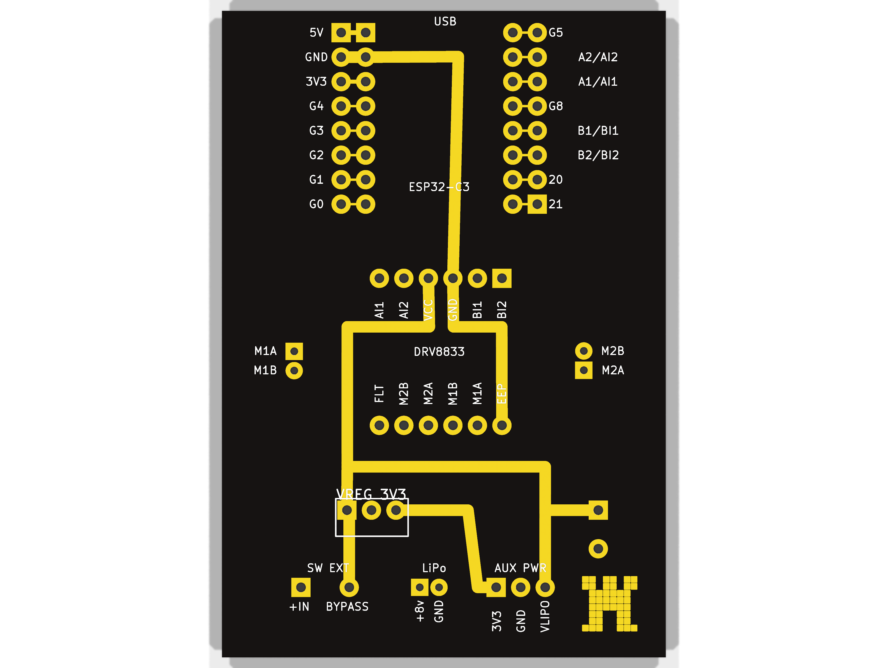

# KiCad antweight controller v2 - hsd-antweight-2s-pcb

This KiCad 9 project is the current 2S-oriented board variant with
externalized power interfaces.

## Status

The schematic is documented and the PCB is now proto-ready for
PCBWay 2-layer fabrication.

This folder diverges from the archived 1S board layout by externalizing
the power path:

- `SW1` is a 2-pin external switch header (`VBAT_RAW` <-> `VBAT_SW`).
- Bypass mode uses a 2-pin shunt directly on `SW1`.
- `U3` is a 3-pin external regulator header
  (`VIN`, `GND`, `VOUT=3V3`).

Use this revision for prototype fabrication only.
It is not yet a locked mass-production release.

## Validation

```bash
kicad-cli sch erc --severity-error \
  electronics/kicad/hsd-antweight-2s-pcb/rein-2s-controller.kicad_sch
kicad-cli sch export netlist \
  electronics/kicad/hsd-antweight-2s-pcb/rein-2s-controller.sch
kicad-cli pcb drc \
  electronics/kicad/hsd-antweight-2s-pcb/rein-2s-controller.kicad_pcb \
  --severity-all
```

Latest validation snapshot (2026-08-12):

- ERC errors: 0 (`--severity-error` gate passes)
- DRC violations: 0
- Unconnected pads: 0
- Footprint errors: 0
- Full ERC warning report still contains expected legacy wiring warnings.

Before manufacturing review:

- convert the schematic fully to native KiCad format;
- replace all `*_VERIFY` footprints with production footprints;
- rerun ERC and DRC after every electrical/layout change;
- inspect antenna clearance and high-current routes.

## PCBWay proto package

Generated package root:

- `production/pcbway/`

Upload-ready archive:

- `production/pcbway/rein-2s-controller-pcbway-proto-package-2026-08-12.zip`

Contents:

- `gerbers/`: copper, mask, silkscreen and edge cuts Gerbers
- `drill/`: PTH/NPTH drill files, maps and drill report
- `rein-2s-controller-pos.csv`: placement file
- `rein-2s-controller-bom.csv`: BOM export
- `rein-2s-controller.net`: KiCad netlist export

## 3D render (current revision)

Render images are stored in `renders/`.
All renders in this folder are PCB-only (no external connectors, modules or capacitors).

Primary preview (top overview, PCB-only):



Generated artifacts (6 views):

- Top:
  - `renders/pcbway-bare-top-1-overview.png`
  - `renders/pcbway-bare-top-2-angle-left.png`
  - `renders/pcbway-bare-top-3-angle-right.png`
- Bottom:
  - `renders/pcbway-bare-bottom-1-overview.png`
  - `renders/pcbway-bare-bottom-2-angle-left.png`
  - `renders/pcbway-bare-bottom-3-angle-right.png`

Render command:

Settings below are tuned so the complete PCB (including holes, pads,
traces and vias) stays visible in frame.

```bash
PCB="electronics/kicad/hsd-antweight-2s-pcb/rein-2s-controller.kicad_pcb"
TMP="electronics/kicad/hsd-antweight-2s-pcb/rein-2s-controller-no-components.tmp.kicad_pcb"

perl -ne '
sub balance { my ($s)=@_; my $o=()=$s=~/\(/g; my $c=()=$s=~/\)/g; return $o-$c; }
if (!$skip && /\(footprint /) { $skip=1; $depth=balance($_); next; }
if ($skip) { $depth += balance($_); if ($depth <= 0) { $skip=0; } next; }
print;
' "$PCB" > "$TMP"

kicad-cli pcb render \
  --width 3200 \
  --height 2400 \
  --background transparent \
  --quality high \
  --zoom 1.00 \
  --rotate "0,0,0" \
  --side top \
  --output \
  electronics/kicad/hsd-antweight-2s-pcb/renders/pcbway-bare-top-1-overview.png \
  "$TMP"

kicad-cli pcb render \
  --width 3200 \
  --height 2400 \
  --background transparent \
  --quality high \
  --perspective \
  --zoom 1.04 \
  --rotate "-20,0,18" \
  --side top \
  --output \
  electronics/kicad/hsd-antweight-2s-pcb/renders/pcbway-bare-top-2-angle-left.png \
  "$TMP"

kicad-cli pcb render \
  --width 3200 \
  --height 2400 \
  --background transparent \
  --quality high \
  --perspective \
  --zoom 1.04 \
  --rotate "20,0,-18" \
  --side top \
  --output \
  electronics/kicad/hsd-antweight-2s-pcb/renders/pcbway-bare-top-3-angle-right.png \
  "$TMP"

rm -f "$TMP"
```

Render bottom views (PCB-only):

```bash
PCB="electronics/kicad/hsd-antweight-2s-pcb/rein-2s-controller.kicad_pcb"
TMP="electronics/kicad/hsd-antweight-2s-pcb/rein-2s-controller-no-components.tmp.kicad_pcb"

perl -ne '
sub balance { my ($s)=@_; my $o=()=$s=~/\(/g; my $c=()=$s=~/\)/g; return $o-$c; }
if (!$skip && /\(footprint /) { $skip=1; $depth=balance($_); next; }
if ($skip) { $depth += balance($_); if ($depth <= 0) { $skip=0; } next; }
print;
' "$PCB" > "$TMP"

kicad-cli pcb render \
  --width 3200 \
  --height 2400 \
  --background transparent \
  --quality high \
  --zoom 1.00 \
  --rotate "0,0,0" \
  --side bottom \
  --output \
  electronics/kicad/hsd-antweight-2s-pcb/renders/pcbway-bare-bottom-1-overview.png \
  "$TMP"

kicad-cli pcb render \
  --width 3200 \
  --height 2400 \
  --background transparent \
  --quality high \
  --perspective \
  --zoom 1.04 \
  --rotate "-20,0,18" \
  --side bottom \
  --output \
  electronics/kicad/hsd-antweight-2s-pcb/renders/pcbway-bare-bottom-2-angle-left.png \
  "$TMP"

kicad-cli pcb render \
  --width 3200 \
  --height 2400 \
  --background transparent \
  --quality high \
  --perspective \
  --zoom 1.04 \
  --rotate "20,0,-18" \
  --side bottom \
  --output \
  electronics/kicad/hsd-antweight-2s-pcb/renders/pcbway-bare-bottom-3-angle-right.png \
  "$TMP"

rm -f "$TMP"
```

## Release checklist

- [ ] `*_VERIFY` footprints replaced by production footprints.
- [ ] Mounting-hole implementation and coordinates verified.
- [ ] Current ratings validated for switch and connectors.
- [x] ERC and DRC rerun and reports archived.
- [ ] Final visual review completed.