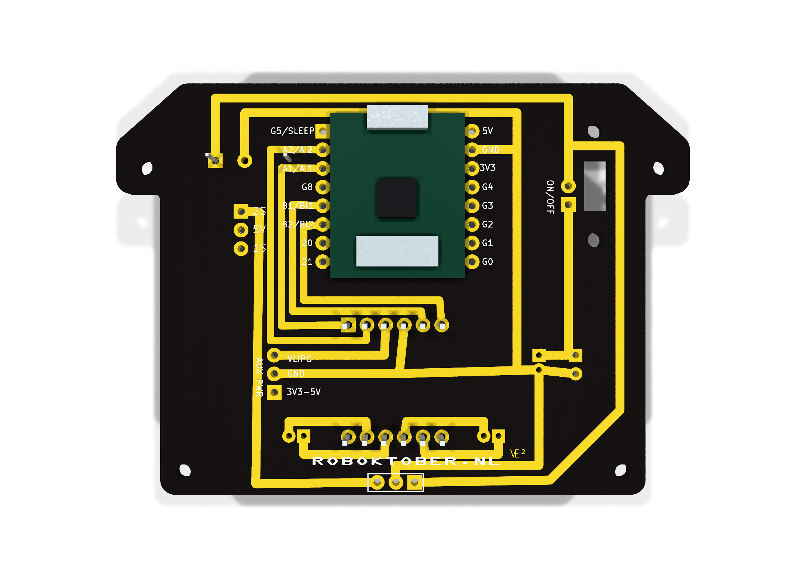
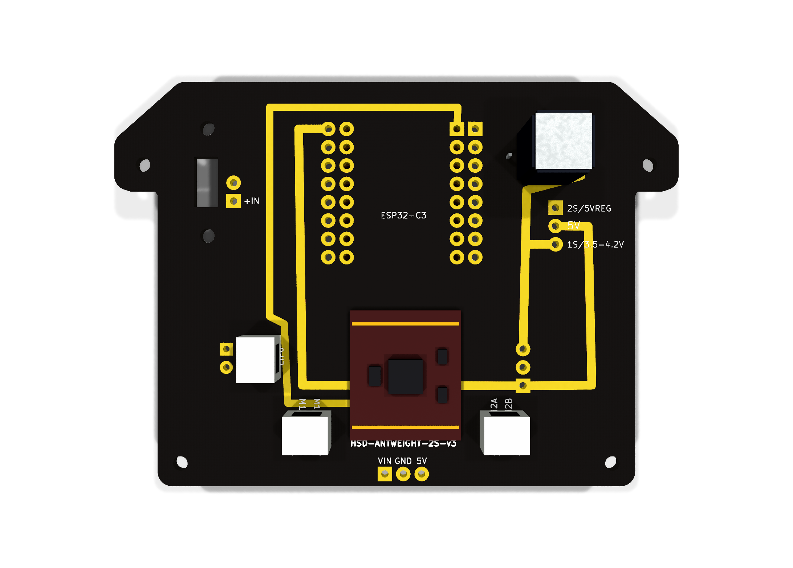

# V3-fix print: gebruikershandleiding

Deze pagina is bedoeld voor mensen die de print voor het eerst willen gebruiken of bouwen. De informatie hier is geschreven voor beginners, maar wel gebaseerd op de werkelijke, geteste print.

Belangrijk: bij twijfel geldt de print als bron van waarheid. Als een label, schema of document iets anders zegt dan de PCB, dan is de print zelf het juiste referentiepunt.

## Snelle keuze: welke voeding kies ik?

| Keuze | Configuratie | Voordeel | Nadeel | Beste voor |
| --- | --- | --- | --- | --- |
| 1S standaard | 1S accu direct naar ESP_5V_IN | licht, simpel, klein | minder runtime | eerste tests en standaard robotbouw |
| 2S met regelaar | 2S accu -> 5V regulator -> ESP_5V_IN | meer vermogen, sneller | meer aandacht nodig | meer power en hogere snelheid |
| 18650 UPS-board met boost | 18650 cel -> boost board -> 5V | veel runtime en energie | zwaarder, complexer | langere runs, meer power |

Als je niet zeker bent, begin met de standaard 1S-opstelling. Dat is de eenvoudigste en lichtste keuze.

## 1. Wat is deze print?

Dit is de verbeterde v3-fix controllerprint voor de antweight-robot. De print bevat:

- een ESP32-C3 SuperMini
- een DRV8833 motorstuurmodule
- voeding voor de ESP en de motoren
- connectors voor batterij, motoren en uitbreidingen
- een jumper voor de juiste voedingskeuze

Deze specifieke bouw gebruikt daarnaast twee kleine N20-motoren van ongeveer 500 rpm. De batterij is een 1S-accu met een XH2.54/JST-aansluiting. In deze configuratie geldt dat de totale belasting meestal in de buurt van ongeveer 300 mA ligt, afhankelijk van motorbelasting, weerstand en werkcyclus.

Het doel is om een compacte, werkbare controller te maken die zowel met een 1S- als met een 2S-batterij kan werken, afhankelijk van de gekozen configuratie.

## 2. Belangrijkste regel: de voeding

Deze print heeft een speciale voedingsafspraak die beginners vaak over het hoofd zien.

### Standaard voor deze bouw

Voor deze robotbouw is de standaardopstelling een 1S-accu met XH2.54/JST-aansluiting, die direct op de ESP-voeding gaat:

- 1S accu -> ESP_5V_IN

Dat betekent:

- de accu is een 1S-cel, dus ongeveer 3,7V tot 4,2V onder belasting en bij volle lading
- de motoren zijn kleine N20-motoren van 500 rpm en zijn dus niet bedoeld voor grote stroompieken
- de print is ontworpen om deze compacte robotconfiguratie te laten werken zonder extra externe regulator in de standaard setup

### Standaard voor de meeste gebruikers

De print is getest en werkt standaard met een 1S-batterij die direct op de ESP-voeding gaat:

- batterij -> ESP_5V_IN

Dat betekent:

- de ESP krijgt direct een 5V-voeding vanuit de batterij
- de ESP-module maakt intern zelf 3.3V voor zijn logica
- je hoeft geen aparte externe regulator te gebruiken in de standaard 1S-configuratie

Dit is de default-stand voor deze v3-fix print.

### Alternatieve 2S-configuratie

Als je een grotere accu wilt gebruiken, kun je ook 2S kiezen, zolang je daarna een spanningsregelaar gebruikt om 5V te maken voor de ESP:

- 2S accu -> spanningsregelaar -> ESP_5V_IN

Dit is de alternatieve manier. De print heeft hier een expliciete jumper voor. In deze configuratie kan de motor sneller draaien, omdat hij meer spanning krijgt dan bij de standaard 1S-setup.

> Let op: met een 2S-accu en een 5V-regelaar gaat de motor sneller en de totale belasting kan hoger worden. De print is wel geschikt voor deze setup, maar je moet dan extra opletten op de juiste regulator, juiste jumper en veilige testprocedure.

### Alternatieve optie: 18650 UPS-board met ingebouwde 5V-boost

Er is ook nog een andere praktische optie: een 18650 UPS-board met een ingebouwde 5V-boost. Dan kun je bijvoorbeeld een 18650-cel gebruiken die een hoger vermogen heeft, terwijl het board zelf 5V maakt voor de ESP.

- 18650 cel -> UPS/boost board -> 5V uitgang -> ESP_5V_IN

Voordelen:

- meer energie beschikbaar dan bij een kleine 1S-accu
- vaak veel hogere capaciteit, bijvoorbeeld rond 2000 mAh
- handig als je meer runtime wilt zonder steeds opnieuw te laden
- ingebouwde boost maakt het makkelijk om een vaste 5V-rail te hebben

Nadelen:

- zwaarder dan een kleine 1S-setup
- meer volume en extra componenten
- extra complexiteit en meer kans op foutieve aansluitingen
- een UPS-board is niet per se een "drop-in" oplossing als je de print en de voedingsroute niet goed overlegt

### Praktische keuze

Voor deze robot zijn de keuzes ongeveer:

- 1S direct op ESP_5V_IN: lichtste, simpelste en standaard keuze
- 2S met regelaar: meer vermogen, snellere motor, maar ook meer aandacht nodig
- 18650 UPS-board met boost: veel meer energie, maar zwaarder en complexer

Voor beginners is de 1S-setup meestal het meest overzichtelijk. Voor meer runtime en meer power is een 18650 UPS-board een goede optie, maar dan wordt de totale bouw zwaarder en minder compact.

## 3. Overzicht van de print: componenten en aansluitingen

Hieronder staat een visuele uitleg van de actuele v3-fix print. Deze afbeeldingen zijn gebaseerd op de echte renderbestanden uit deze map en helpen je om snel te zien waar de belangrijkste onderdelen zitten.

### 3.1 Bovenaanzicht van de print

> Deze originele renders zijn opnieuw gegenereerd uit de actuele KiCad-PCB van deze v3-fix versie, niet meer uit een oudere versie van de print.

Hoofdzaken op deze foto:

- links/rechts: motorconnectors
- midden: ESP32-C3 SuperMini
- centraal boven/onder: DRV8833-motorstuurmodule
- batterij- en voedingspunten: duidelijk op de print te herkennen
- jumper JP1: bepaalt welke voedingsroute de ESP krijgt

### 3.2 Onderzijde / achterzijde van de print

Dit geeft het fysieke beeld van de achterkant van de print. Hier zie je hoe de return paths, massa-rails en de onderzijde van de driver en headers liggen.

### 3.3 Zicht op de connectoren en voedingslijnen

Op deze weergave zijn vooral de aansluitingen belangrijk:

- battery / power input
- motorlinks en motorrechts
- ESP-voedingsingang
- GND en power rail
- jumper voor de keuze tussen 1S en 2S

### 3.4 Snel overzicht van de belangrijkste locaties

| Gebied | Wat daar zit | Wat je moet onthouden |
| --- | --- | --- |
| ESP32 module | centrale controller | ontvangt 5V via ESP_5V_IN |
| DRV8833 | motorsturing | model DRV8833, duidelijk zichtbaar op de achterkant van de print |
| batterijaansluiting | spanning voor de motoren en de power-path | niet direct op 3.3V van de ESP |
| jumper JP1 | voedingkeuze | bepaalt 1S direct of 2S via regulator |
| motorconnectors | linker en rechter motor, als 2x2 pin-header paren | alleen op de juiste motorconnector aansluiten |
| GND-rail | massa | alle delen moeten op dezelfde grond terugkeren |

### 3.6 Hoe je de aansluitingen op de print herkent

Als je zelf aan de print werkt, probeer deze gebieden altijd terug te vinden op de render voordat je gaat solderen of bedraden:

- zoek eerst de ESP-module
- zoek daarna de DRV8833 op de voorkant en achterkant
- vind daarna de motoraansluitingen: twee aparte 2x2 pin-headerparen, links en rechts
- vind vervolgens de batterij- en power-header
- controleer ten slotte de jumper en de labels op de silkscreen

> De render is bedoeld om je de fysieke route te laten zien. De echte PCB blijft de bron van waarheid, maar deze afbeeldingen helpen enorm bij het herkennen van de juiste onderdelen en aansluitingen.

## 4. De jumper begrijpen

Op de print zit een jumper met de naam JP1.

Deze jumper bepaalt hoe de ESP wordt gevoed.

### Optie A: 1S direct naar ESP

- jumper zet de ESP direct op de 1S-voeding
- handig voor de standaard, eenvoudige setup
- alleen geschikt voor de getest gevalideerde ESP32-C3 module

### Optie B: 2S via regulator

- jumper kiest de 2S-weg via de regulator
- geschikt voor een 2S-batterij met de juiste regeling
- deze route is bedoeld als alternatief, niet als standaard voor beginners

> Let op: de 1S-weg is de default die in praktijk is getest en werkt. Gebruik deze alleen als je zeker weet dat de module en de stroomvereisten passen.

## 4. Wat gaat waar naartoe?

### Batterij

De batterij wordt aangesloten op het batterijblok of de batterijheader van de print.

Voor deze robot is dat in de praktijk een 1S-accu met een XH2.54/JST-connector. De connector is compact en past bij de kleine robotbouw, maar het is belangrijk dat je de juiste polariteit en de juiste stroomcapaciteit gebruikt.

- raw batterijspanning komt op de batterijlijn
- de print schakelt daarna door naar de juiste rail voor de ESP en motoren
- in deze configuratie is de typische stroom in de buurt van 300 mA, afhankelijk van de werkelijke belasting van de N20-motoren

### Motoren

Er zijn twee motorconnectors op de print:

- linker motor
- rechter motor

Deze zijn bedoelt voor de DRV8833-stuurmodule. In deze bouw zitten daar twee kleine N20-motoren van 500 rpm aan, een links en een rechts.

### ESP32-C3 SuperMini

De ESP is aangesloten op de controllerpins voor:

- motorbesturing
- status LED
- sleep/disable-signaal
- eventuele uitbreidingen

Belangrijk: GPIO5 wordt gebruikt als slaap-/besturingspin voor de driver. Dit is niet hetzelfde als een willekeurige vrije GPIO; het is een vaste functie op deze print.

## 5. Stap-voor-stap voor een eerste opstart

### Stap 1: controleer de print

- controleer op beschadigde sporen of pads
- controleer of de batterijconnector correct is aangesloten
- controleer of de jumper juist staat voor je keuze

### Stap 2: kies de juiste voedingsmodus

Gebruik deze simpele regel:

- 1S batterij, standaard: jumper op de directe 1S/ESP-weg
- 2S batterij: jumper op de regulator-weg

Als je niet zeker bent, begin met de standaard 1S-configuratie en controleer daarna pas de alternatieve variant.

### Stap 3: sluit de batterij aan

- zet de stroom uit voordat je iets aansluit
- sluit de batterij met juiste polariteit aan
- controleer dat GND correct is verbonden

### Stap 4: sluit de motoren aan

- sluit de linker motor aan op de linker connector
- sluit de rechter motor aan op de rechter connector
- controleer nogmaals of de polariteit en pinning kloppen

### Stap 5: zet de print aan

- zet de hoofdschakelaar aan
- controleer of de ESP opstart
- controleer de status LED en gedrag van de motoren

### Stap 6: eerste test zonder belasting

Doe de eerste test met:

- geen zware belasting
- geen motors met enorme weerstand
- een beperkte stroomtest of korte proefrit

Dat voorkomt schade tijdens de eerste opstart.

## 5a. Testen met USB-5V op de print

Je kunt de ESP ook testen zonder de accu aan te sluiten, door de print via een USB-kabel te voeden met 5V.

### Hoe werkt dat?

- sluit een USB-kabel aan op de ESP-module of op het juiste 5V-ingangspunt van de print
- de ESP krijgt dan 5V via USB
- de print kan dan opstarten zonder dat er een batterij is aangesloten

### Belangrijk: wat als de accu nog wel verbonden is?

Dit is de belangrijkste regel voor een veilige test:

- als de accu nog is aangesloten terwijl je USB-5V toevoert, kunnen beide voedingen tegelijk op de print aanwezig zijn
- dat is niet automatisch gevaarlijk, maar het is wel belangrijk om te weten dat de voedingsstromen dan kunnen samenkomen
- in de praktijk kan dat leiden tot ongewenste backfeeding, onduidelijke spanning op de rails of verrassend gedrag als je niet precies weet welke voeding de print "ziet"

### Praktische vuistregel

Gebruik deze volgorde altijd:

1. eerst de print op een veilige manier isoleren
2. of zet de batterij los
3. of gebruik alleen USB-5V voor de test
4. zet de accu pas weer aan nadat je zeker weet dat de juiste jumper en voedingsroute zijn gekozen

### Aanbevolen testmethode

Voor een eerste bench-test:

- zet de batterij los
- geef de print voeding via USB-5V
- start de ESP en controleer het gedrag
- sluit daarna pas de accu aan, als je de volledige batterijconfiguratie wilt testen

### Wat je niet moet doen

- niet zonder nadenken USB-5V en accu tegelijk laten staan
- niet aannemen dat de print automatisch "eigenlijk weet" welke voeding de juiste is
- niet zomaar een batterij aansluiten terwijl de USB-voeding nog draait

> Kort gezegd: USB-5V is handig voor testen, maar voor een nette en veilige test moet je de batterij meestal loskoppelen. Anders kan de print een dubbelvoeding krijgen, wat onduidelijk gedrag kan veroorzaken.

## 6. Veilige bedradingsregels voor beginners

### Wat je niet moet doen

- geen raw batterij direct op de 3.3V-rail van de ESP zetten
- de ESP niet op een verkeerd voedingspunt aansluiten
- een motor niet rechtstreeks op een ESP-pin aansluiten
- de bootgevoelige pins (zoals GPIO8 en GPIO9) niet onnodig belasten
- de juiste jumper niet vergeten

### Wat wel goed is

- de ESP alleen op ESP_5V_IN of de juiste 5V-weg voeden
- de motoraansluitingen alleen op de motorconnectors zetten
- de batterij alleen op de daarvoor bestemde batterijlijnen aansluiten
- grond (GND) goed aansluiten tussen print, ESP en batterij

## 7. Aanbevolen power modes

| Configuratie | Werkwijze | Wanneer gebruiken | Opmerking |
| --- | --- | --- | --- |
| 1S standaard | batterij direct naar ESP_5V_IN | beginners / standaard test | geteste default-setup |
| 2S alternatief | batterij via regulator naar ESP_5V_IN | als je expliciet 2S wilt gebruiken | alleen met juiste jumper/regelaar |

## 8. Veelvoorkomende problemen

### De ESP start niet

Mogelijke oorzaken:

- verkeerde jumper gekozen
- batterij te laag of verkeerd aangesloten
- GND niet correct verbonden
- ESP-module niet compatibel met de gekozen voeding

### De motoren reageren niet goed

Mogelijke oorzaken:

- verkeerde motorconnector gebruikt
- driver niet correct aangezet
- GPIO5/sleep-signaal niet correct
- motoren zijn op de verkeerde pins aangesloten

### De print reset tijdens gebruik

Mogelijke oorzaken:

- batterijspanning onder de minimale waarde
- voeding te laag op ESP_5V_IN
- kortsluiting of verkeerde belasting

## 9. Korte technische samenvatting

Voor de bouwers en testers:

- ESP-voeding: ESP_5V_IN
- 1S default: direct naar ESP_5V_IN
- 2S alternatief: via REG_5V_OUT naar ESP_5V_IN
- motorstuur: DRV8833
- sleep/control: GPIO5
- common ground: GND

## 10. Conclusie

Deze v3-fix print is bedoeld om eenvoudig te gebruiken, maar de juiste voedingskeuze is cruciaal. Voor de meeste beginners is de 1S-stand de juiste start. Als je de juiste jumper gebruikt en de print op de juiste manier aansluit, kun je veilig en eenvoudig beginnen met testen.

Als je nog niet zeker weet welke instelling je nodig hebt, begin met de standaard 1S-setup en controleer daarna pas of je naar de 2S-variant wilt overschakelen.

## 11. Bestanden in deze map

- PCB: `hsd-antweight-2s-v3.kicad_pcb`
- Schema: `hsd-antweight-2s-v3.kicad_sch`
- Projectbestand: `hsd-antweight-2s-v3.kicad_pro`
- Renderbestanden: map `renders/`
- Artwork: map `artwork/`

## 12. Belangrijkste opmerking

Deze print is de werkelijke bron van waarheid. De schema- en documentatieversies zijn hulpmiddelen; als iets niet overeenkomt, dan is de PCB zelf de juiste referentie.

---

Als je wilt, kan ik hierna ook nog een kortere versie maken voor de project-landing page of een extra "quick start"-blad in de docs-map.