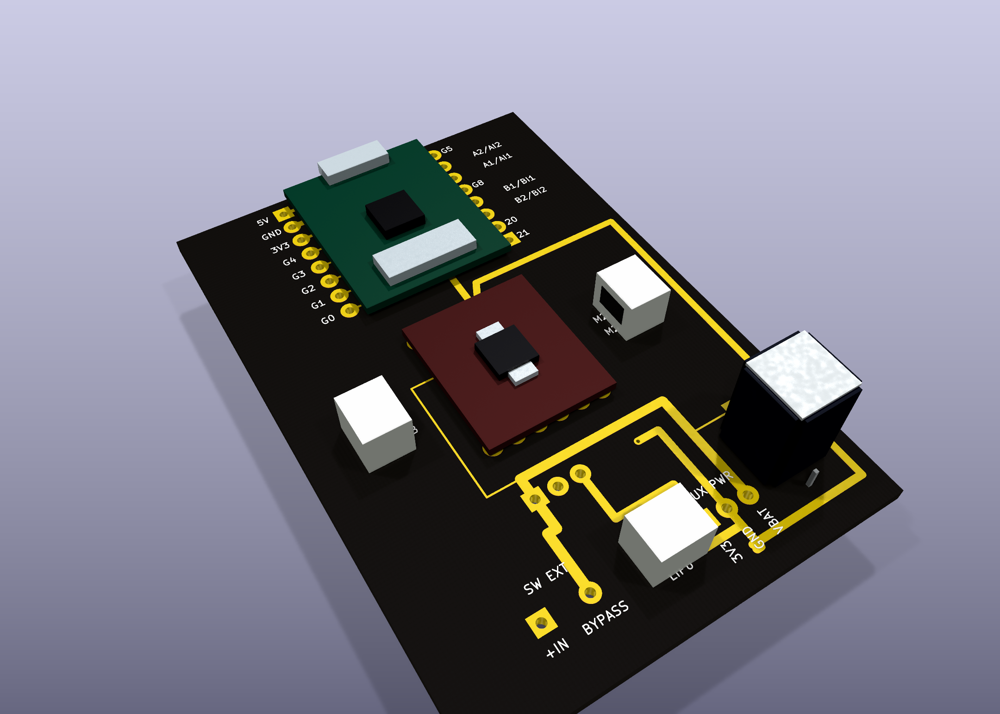

# KiCad antweight controller v2 - rein3-2s external-power variant

This KiCad 9 project implements a separate 2S-oriented rein3 variant with external power interfaces.

## Status

The schematic is electrically documented and the PCB is still pre-release. This folder diverges from `rein3` by externalizing the power path interfaces:
- `SW1` is a 2-pin external switch header (`VBAT_RAW` <-> `VBAT_SW`).
- Bypass mode is done with a 2-pin shunt directly on `SW1` (no separate jumper footprint).
- `U3` is a 3-pin external regulator header (`VIN`, `GND`, `VOUT=3V3`) for an external module.

Do not generate or order manufacturing files from this revision.

## Validation

```bash
kicad-cli sch erc electronics/kicad/rein3-2s/rein-2s-controller.kicad_sch
kicad-cli sch export netlist electronics/kicad/rein3-2s/rein-2s-controller.sch
kicad-cli pcb drc electronics/kicad/rein3-2s/rein-2s-controller.kicad_pcb --severity-all
```

Expected at this stage:

- schema and PCB parse successfully in KiCad 9;
- the legacy schematic netlist command completes, but KiCad 9 exports an empty netlist until this hand-written `.sch` is converted to native `.kicad_sch`;
- no PCB footprint or copper-clearance errors;
- PCB DRC reports zero violations;
- 0 unconnected routing items remain;
- legacy schematic ERC reports abstract-header and label warnings.

Before completing routing, convert the schematic to native KiCad format, replace all `VERIFY` footprints, rerun ERC/DRC and inspect antenna clearance.

The U1/U2 socket pads currently retain conservative 1.0 mm drills. Update pad and annular-ring dimensions from the selected machined socket strip datasheet before manufacturing.

## Current release blockers (remaining)

- Replace all `*_VERIFY` footprints with supplier-specific production footprints.
- Verify and lock mechanical mounting-hole implementation and coordinates (M2 target).
- Record measured left/right motor stall current at fully charged 1S voltage.
- Record selected switch and connector DC-current ratings against measured current.
- Re-run ERC/DRC after the above changes and archive the updated reports.

## 3D render (current revision)

Primary preview (with components, top side):



Render definitions used in this folder:
- `with-components` = assembly view with mounted board parts (DRV8833 module, ESP module, driver capacitor, and connectors) plus two N20 motors connected by wires to the motor connectors.
- `without-components` = PCB-only board render (no footprint/component bodies).

Motor mapping in the with-components assembly view:
- N20 RIGHT motor -> `M1A`/`M1B` (`MOTOR R` connector)
- N20 LEFT motor -> `M2A`/`M2B` (`MOTOR L` connector)

Generated artifact:
- `rein-2s-controller-3d-with-components-top-2026-08-10.png`
- `rein-2s-controller-3d-without-components-top-2026-08-10.png`
- `rein-2s-controller-3d-without-components-bottom-2026-08-10.png`

Render command (reproducible):

```bash
kicad-cli pcb render \
	--width 2200 \
	--height 1600 \
	--background transparent \
	--quality high \
	--perspective \
	--zoom 1.35 \
	--rotate "-35,0,25" \
	--side top \
	--output electronics/kicad/rein3-2s/rein-2s-controller-3d-with-components-top-2026-08-10.png \
	electronics/kicad/rein3-2s/rein-2s-controller.kicad_pcb
```

Render both sides without components (temporary footprint-stripped board):

```bash
PCB="electronics/kicad/rein3-2s/rein-2s-controller.kicad_pcb"
TMP="electronics/kicad/rein3-2s/rein-2s-controller-no-components.tmp.kicad_pcb"

perl -ne '
sub balance { my ($s)=@_; my $o=()=$s=~/\(/g; my $c=()=$s=~/\)/g; return $o-$c; }
if (!$skip && /\(footprint /) { $skip=1; $depth=balance($_); next; }
if ($skip) { $depth += balance($_); if ($depth <= 0) { $skip=0; } next; }
print;
' "$PCB" > "$TMP"

for side in top bottom; do
	kicad-cli pcb render \
		--width 2200 \
		--height 1600 \
		--background transparent \
		--quality high \
		--perspective \
		--zoom 1.35 \
		--rotate "-35,0,25" \
		--side "$side" \
		--output "electronics/kicad/rein3-2s/rein-2s-controller-3d-without-components-${side}-2026-08-10.png" \
		"$TMP"
done

rm -f "$TMP"
```

Notes:
- This render set is for design review and communication.
- The `with-components` image is an assembly visualization (board render + external motor/wire overlay), used to show intended real-world hookup.
- The board is still development-stage unless explicitly marked manufacturing-ready.
- Re-run DRC after routing changes before generating manufacturing output.

## Routing completion checklist (from latest DRC)

Current blocker count: 0 unconnected items, 0 DRC violations.

Use this as the finishing checklist before a manufacturing-ready release.

### 1. Ground and power backbone

- [x] Connect all `GND` islands between `U3`, `J4`, `J10`, `C1_C2`, and `U2`.
- [x] Connect `VBAT_SW` chain between `U3`, `SW1`, `C1_C2`, `U2`, and `J10`.
- [x] Connect `3V3` from `U3` to `J10` and to the existing `3V3` track near `U2`.

### 2. Driver control signals (ESP32 -> DRV8833)

- [x] Connect `AIN2_GPIO6` from `U2` control pad to the matching track segment.
- [x] Connect `AIN1_GPIO7` from `U2` control pad to the matching track segment.
- [x] Connect `BIN1_GPIO9` from `U2` control pad to the matching track segment.
- [x] Connect `BIN2_GPIO10` from `U2` control pad to the matching track segment.

### 3. Motor output paths (DRV8833 -> connectors)

- [x] Connect `M1A` from `U2` to `J5`.
- [x] Connect `M1B` from `U2` to `J5`.
- [x] Connect `M2A` from `U2` to `J6`.
- [x] Connect `M2B` from `U2` to `J6`.

### 4. Release gates (must all pass)

- [x] `kicad-cli pcb drc ... --severity-all` returns 0 DRC violations.
- [x] Unconnected items count is `0` (not 20).
- [ ] ERC/DRC rerun after any footprint replacement.
- [ ] Board-level visual review done for antenna clearance and high-current routes.
- [ ] `*_VERIFY` footprints replaced by locked production footprints.
- [ ] Mechanical mounting-hole positions confirmed for enclosure/chassis.

When all checklist items are complete, the board can move from "DRC-clean prototype" to "candidate for manufacturing review".