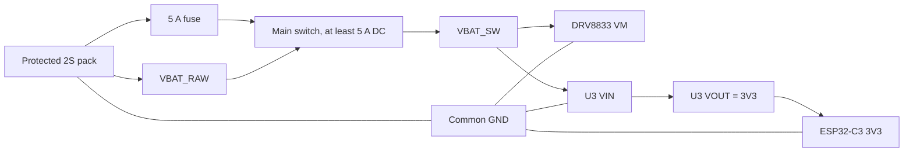

# Electrical design v2-2S

## Status

This is the active design contract for the separate 2S controller
variant.

Implementation status:

- KiCad project path: `electronics/kicad/hsd-antweight-2s-pcb/`
- Layout state: proto-ready (PCBWay 2-layer), not mass-production locked

This does not make the archived legacy v2 PCB 2S-compatible.
Do not connect a 2S pack to the archived legacy board.

## Design targets

| Item | Requirement |
| --- | --- |
| Battery | Protected 2S LiPo/Li-ion, 6.0-8.4 V, external balance charger |
| Motors | Two 6 V N20 50:1 gearmotors, approximately 600 RPM |
| Motor rail | Direct switched 2S, 6.0-8.4 V |
| Motor control | Full 0-100% PWM; no external motor current limiter |
| Logic rail | Regulated 3.3 V, 1 A total |
| Common return | Battery, converter, driver and ESP32 share GND |

The [N20 6 V 50:1 verification record](../components/n20-6v-50-1-verification.md) cross-checks two published 6 V 50:1 micro-metal gearmotor variants: [Pololu HP #998](https://www.pololu.com/product/998) is specified at 590 RPM and 1.6 A theoretical stall at 6 V, while [HPCB #3063](https://www.pololu.com/product/3063) is specified at 650 RPM and 1.5 A. At 8.4 V, linear extrapolation gives approximately 826/910 RPM and 2.24/2.10 A stall respectively. Stalling is an abnormal short-duration condition and can rapidly damage the motor, gearbox or driver.

## Power architecture

The DRV8833 VM input receives switched 2S voltage directly and firmware permits 255/255 duty. At full duty the motors receive the complete pack voltage continuously. The protected pack/BMS and 5 A fuse protect the battery wiring, the DRV8833 internal over-current/thermal shutdown protects the driver, and the 200 ms radio failsafe covers link loss. None of these guarantees a stopped motor during a persistent mechanical stall.

## Logic converter

Selected reference: adjustable external DC-DC converter, connected on U3 as `VIN`, `GND`, `VOUT` and set to 3.3 V before installation.

Design rule: ESP32 logic supply is fixed at `3V3`. Do not set the converter to
`3V5` unless the PCB net naming, connector labeling and validation plan are
explicitly revised.

| Property | Design value |
| --- | --- |
| Output | Adjustable; set and verify 3.3 V before connecting ESP32 |
| Input range | Must support 6.0-8.4 V 2S input |
| Design load | 1 A maximum total after thermal and ripple validation |
| Interface | Three board pins on U3: `VIN`, `GND`, `VOUT(3V3)` |
| Integration | Mount or wire the converter so U3 pin order and polarity remain explicit |

Any chosen converter module is variant-dependent; verify board markings, polarity and thermal behavior on the received part before soldering.

Reserve at least 600 mA transient capacity for the ESP32-C3. Until measured otherwise, limit external 3.3 V accessories on J10 to 300 mA continuous so converter and radio transient margin remain available.

U3 exposes three 2.54 mm through-holes: `VIN` (switched raw battery), `GND` (common return), `VOUT` (logic rail, labeled `3V3`). Keep converter interconnects short, insulated and strain-relieved.

Place at least 10 uF input bulk capacitance close to VIN/GND and verify the exact module manufacturer's capacitor recommendation. Feed the converter directly from `VBAT_SW`, not from a motor output or PWM node.

## Board interfaces

The current 2S carrier uses these power interfaces:

| Connector | Pins | Rating and purpose |
| --- | --- | --- |
| J4 | `VBAT_RAW`, `GND` | Keyed battery connector, at least 5 A DC |
| SW1 | `VBAT_RAW`, `VBAT_SW` | External switch or bypass shunt interface |
| U3 | `VIN`, `GND`, `VOUT(3V3)` | External logic-converter interface |
| J10 | `3V3`, `GND`, `VBAT_SW` | Accessory power; silk labels the raw rail as `VLIPO`; 3.3 V accessories limited to 300 mA continuous pending test |

Label J10 raw power explicitly as `2S RAW 8.4V MAX`; it is no longer a low-voltage accessory rail in the legacy design.

PCB branding silk currently reads `HACKERSPACE` / `DRENTHE` on the logo area.

## Driver constraint

The DRV8833 IC accepts 8.4 V because its operating motor-supply range extends to 10.8 V. The design intentionally uses the existing breakout without an external current limiter. Its approximately 1.5 A RMS and 2 A peak output capability is close to the extrapolated 2.10-2.24 A motor stall current, so simultaneous stall may activate the driver's internal over-current or thermal shutdown.

Release requires bench validation of simultaneous startup, reversal and a brief controlled stall on the exact motors and breakout. The driver protection must operate without PCB, connector or wire overheating. Persistent stall testing must use a current-limited bench supply because the driver may automatically retry after a fault. Do not claim continuous stall capability or increased continuous motor torque.

## Capacitors and wiring

- Fit at least 100 nF ceramic and 470 uF low-ESR, rated at least 16 V, at the motor-driver VM/GND connection.
- Fit 100 nF ceramic directly across each motor terminal pair.
- Twist each motor pair and keep it away from the ESP32 antenna.
- Use 20-22 AWG for battery wiring and keep the switched 2S loop short.
- Size unregulated shared motor paths for at least 4.5 A fault/stall current and individual outputs for at least 2.25 A.

## Validation gates

1. Verify battery connector polarity and fuse operation with no modules fitted.
2. Set the external converter to 3.30 V with a multimeter, then verify the rail at 6.0 V and 8.4 V input before fitting the ESP32.
3. Load-test 3.3 V at 1 A and verify temperature, ripple and switch-on overshoot.
4. Verify the ESP32 radio workload together with the intended 3.3 V accessory load.
5. Power the motor driver from a current-limited 8.4 V bench supply without motors and verify all four inputs.
6. Measure each motor's actual stall current briefly with current limiting and wheels raised.
7. Verify 255/255 duty, simultaneous start/reverse behavior and the DRV8833 fault response during a brief controlled stall.
8. Confirm link loss stops both motors within 200 ms at full battery voltage.
9. Record driver, converter, switch, connector and capacitor temperatures at 8.4 V and near pack cutoff.

This variant remains blocked from manufacture until the exact external converter variant and pinout, exact battery connector, protected 2S pack and full-load DRV8833 behavior are verified.