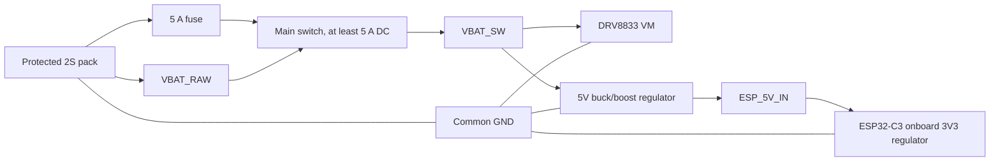

# Electrical design v2-2S

## Status

This document describes the optional 2S route and is retained for historical and
advanced-build comparison. The lead design for new builds is the v4 revision
under `electronics/kicad/hsd-antweight-2s-v4/` with the minimal 1S setup as default.

Implementation status:

- Lead design path: `electronics/kicad/hsd-antweight-2s-v4/`
- Layout state: board-level power rule established; source-of-truth design follows the PCB
- Rule precedence: `v4 PCB` > schematic > reference docs

The older 3.3V-only interpretation is superseded by the validated v4
architecture and must not be treated as the active power contract.

Current default baseline for new builds:

- Minimal 1S setup is the standard.
- Approximate full 1S kit purchase price is around EUR 25 per robot.
- 2S remains optional and requires explicit regulator and validation choices.

## Design targets

| Item | Requirement |
| --- | --- |
| Battery | Protected 2S LiPo/Li-ion, 6.0-8.4 V, external balance charger |
| Motors | Two 6 V N20 50:1 gearmotors, approximately 600 RPM |
| Motor rail | Direct switched 2S, 6.0-8.4 V |
| Motor control | Full 0-100% PWM; no external motor current limiter |
| Logic rail | 5V regulated input to `ESP_5V_IN`; ESP32-C3 regulates internally to 3.3 V |
| Common return | Battery, converter, driver and ESP32 share GND |

The [N20 6 V 50:1 verification record](../components/n20-6v-50-1-verification.md) cross-checks two published 6 V 50:1 micro-metal gearmotor variants: [Pololu HP #998](https://www.pololu.com/product/998) is specified at 590 RPM and 1.6 A theoretical stall at 6 V, while [HPCB #3063](https://www.pololu.com/product/3063) is specified at 650 RPM and 1.5 A. At 8.4 V, linear extrapolation gives approximately 826/910 RPM and 2.24/2.10 A stall respectively. Stalling is an abnormal short-duration condition and can rapidly damage the motor, gearbox or driver.

## Power architecture

The optional 2S architecture uses a single 5V regulator as the primary route to the ESP32-C3 module. The ESP then regulates internally down to 3.3 V; the module's 3.3 V pin is not the primary power input for the board-level design. The optional 2S route is `VBAT -> 5V regulator -> ESP_5V_IN`.

The direct 1S exception remains valid only for the tested, purchased ESP32-C3 module: a direct battery feed to `ESP_5V_IN` at roughly 4.0 V was stable for a 5-minute race profile. This is not a general rule for other modules or boards.

The DRV8833 VM input still receives switched 2S voltage directly and firmware permits 255/255 duty. The protected pack/BMS and 5 A fuse protect the battery wiring, the DRV8833 internal over-current/thermal shutdown protects the driver, and the 200 ms radio failsafe covers link loss.

## Logic converter

Selected reference: 5V DC-DC regulator feeding the ESP via its `5V` input pin. The ESP's own onboard regulator creates the 3.3 V logic rail.

Design rule: the default ESP supply path is `5V -> ESP_5V_IN`; do not treat the ESP's internal 3.3 V rail as a place to inject raw battery power. `VIN -> VOUT` bypass of the ESP 3.3 V rail remains forbidden.

| Property | Design value |
| --- | --- |
| Output | 5V regulator output feeding `ESP_5V_IN` |
| Input range | Must support 6.0-8.4 V 2S input; direct 1S only on validated module |
| Design load | 5V rail sized for ESP and accessory loads after thermal validation |
| Interface | `VBAT_SW -> regulator -> ESP_5V_IN`, plus shared GND |
| Integration | Keep the 5V regulator path explicit and label the 5V input net clearly |

Any chosen converter module is variant-dependent; verify board markings, polarity and thermal behavior on the received part before soldering.

Reserve at least 600 mA transient capacity for the ESP32-C3 in the 2S route. The 1S direct feed is only valid with the specific tested module and should be treated as an exception, not the standard power policy.

The board's 5V rail must be explicit and labeled as `ESP_5V_IN` / `REG_5V_OUT` in the source-of-truth PCB, not as a legacy `3V3` supply.

## Board interfaces

The active v4 carrier uses these power interfaces:

| Connector | Pins | Rating and purpose |
| --- | --- | --- |
| J4 | `VBAT_RAW`, `GND` | Keyed battery connector, at least 5 A DC |
| SW1 | `VBAT_RAW`, `VBAT_SW` | External switch or bypass shunt interface |
| U3 | `VBAT_SW`, `GND`, `REG_5V_OUT` | 5V regulator output feeding the ESP module |
| J10 | `ESP_5V_IN`, `GND`, `VBAT_SW` | Accessory power; pad 1 is the ESP 5V input and is valid in the 3.7-5.0 V tested range for the validated module |

Label J10 pad 1 as `ESP_5V_IN` / `5V(3.7-5V)` in the active board design. The old `3V3` accessory labeling is superseded by the v4 power rule.

PCB branding silk currently reads `HACKERSPACE` / `DRENTHE` on the logo area.

## Driver constraint

The DRV8833 IC accepts 8.4 V because its operating motor-supply range extends to 10.8 V. The design intentionally uses the existing breakout without an external current limiter. Its approximately 1.5 A RMS and 2 A peak output capability is close to the extrapolated 2.10-2.24 A motor stall current, so simultaneous stall may activate the driver's internal over-current or thermal shutdown.

Release requires bench validation of simultaneous startup, reversal and a brief controlled stall on the exact motors and breakout. The driver protection must operate without PCB, connector or wire overheating. Persistent stall testing must use a current-limited bench supply because the driver may automatically retry after a fault. Do not claim continuous stall capability or increased continuous motor torque.

## Capacitors and wiring

- Fit at least 100 nF ceramic and 470 uF low-ESR, rated at least 16 V, at the motor-driver VM/GND connection.
- Fit 100 nF ceramic directly across each motor terminal pair.
- Twist each motor pair and keep it away from the ESP32 antenna.
- Use 20-22 AWG for battery wiring and keep the switched 2S loop short.
- Size unregulated shared motor paths for at least 4.5 A fault/stall current and individual outputs for at least 2.25 A.

## Validation gates

1. Verify battery connector polarity and fuse operation with no modules fitted.
2. Set the external converter to 3.30 V with a multimeter, then verify the rail at 6.0 V and 8.4 V input before fitting the ESP32.
3. Load-test 3.3 V at 1 A and verify temperature, ripple and switch-on overshoot.
4. Verify the ESP32 radio workload together with the intended 3.3 V accessory load.
5. Power the motor driver from a current-limited 8.4 V bench supply without motors and verify all four inputs.
6. Measure each motor's actual stall current briefly with current limiting and wheels raised.
7. Verify 255/255 duty, simultaneous start/reverse behavior and the DRV8833 fault response during a brief controlled stall.
8. Confirm link loss stops both motors within 200 ms at full battery voltage.
9. Record driver, converter, switch, connector and capacitor temperatures at 8.4 V and near pack cutoff.

This variant remains blocked from manufacture until the exact external converter variant and pinout, exact battery connector, protected 2S pack and full-load DRV8833 behavior are verified.