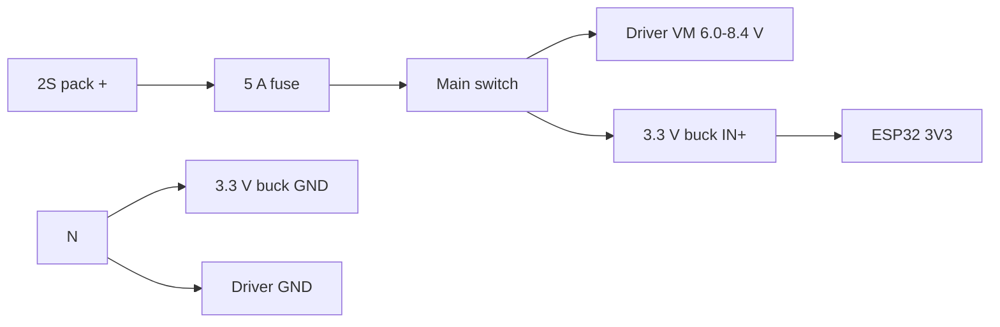

# Antweight controller v2-2S wiring

## Power wiring

The 2S rail feeds the motor driver directly. Only the ESP32 and 3.3 V accessory rail use a regulator.

| Connection | Destination | Suggested color |
| --- | --- | --- |
| `BAT_2S+` | 5 A fuse, then main switch | Red |
| `VBAT_2S_SW` | DRV8833 VM and Mini-360 `IN+` | Red |
| `GND` | DRV8833 GND, Mini-360 `IN-`/`OUT-` and ESP32 GND | Black |
| Mini-360 `OUT+` | ESP32 3V3 and J10 3V3 | Orange |

Route the high-current battery/driver return directly to the battery-ground node. Join the logic-regulator ground at that node rather than carrying motor current through the ESP32 return path.

## Motor connections

Keep the existing two-pin motor connectors on the controller PCB: J5 for the left motor and J6 for the right motor. Each N20 motor uses a detachable two-wire harness with the matching plug at the controller end; solder the other two wire ends directly to the motor terminals.

Before closing the robot, verify forward/reverse direction with the wheels raised. Reverse the two wires at the motor or connector if a side runs opposite to the commanded direction. Add strain relief at the motor terminals and route each harness clear of the wheel, shaft and ESP32 antenna.

Each motor is retained mechanically by two hand-bent steel-wire U-brackets soldered into its four dedicated M1/M2 mounting pads. These pads are mechanical only; do not connect the motor wires to them.

## Complete power path

## Bring-up

1. Disconnect the ESP32, motor driver and motors.
2. Apply a current-limited 7.4 V bench supply and verify 2S polarity.
3. Set the Mini-360 to 3.30 V with a multimeter. Verify 3.3 V and load-test it at 1 A before fitting the ESP32.
4. Fit the ESP32 and verify radio operation with the intended 3.3 V accessories; keep accessory load at or below 300 mA pending measurement.
5. Fit the driver without motors and verify 2S voltage at VM and all four control inputs.
6. Connect motors with wheels raised and verify the full 255/255 PWM range.
7. Repeat startup, reverse, brief controlled-stall and link-loss tests at 8.4 V while monitoring driver temperature and fault behavior.

Never charge the 2S pack through this carrier. Remove it and use a compatible 2S balance charger.

## Mini-360 module

Use a [Mini-360 MP2307DN module](https://www.aliexpress.com/wholesale?SearchText=Mini-360+MP2307DN) only after confirming its printed `IN+`, `IN-`, `OUT-` and `OUT+` markings. Keep the four U3-to-module wires short, insulated and strain-relieved. Never connect the ESP32 until `OUT+` measures 3.30 V relative to `OUT-`.