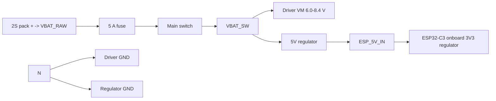

# Antweight controller v2-2S wiring

## Power wiring

The v3-fix design is the active reference. The ESP no longer uses a legacy 3.3V-only supply path as the primary design rule. The standard route is a 5V regulator feeding `ESP_5V_IN`; the ESP32-C3 then generates its own 3.3 V internally.

| Connection | Destination | Suggested color |
| --- | --- | --- |
| `VBAT_RAW` | 5 A fuse, then main switch input (`SW1`) | Red |
| `VBAT_SW` | DRV8833 VM and regulator input | Red |
| `REG_5V_OUT` | ESP32 `ESP_5V_IN` | Orange |
| `GND` | DRV8833 GND, regulator GND, and ESP32 GND | Black |
| J10 pad 1 | `ESP_5V_IN` / valid 3.7-5.0 V feed for tested module | Orange |

J10 pad 3 remains `VBAT_SW` and is silk-labeled `VLIPO` on the PCB. The direct 1S exception is valid only for the specific tested ESP32-C3 module; do not generalize that to other modules or boards.

Route the high-current battery/driver return directly to the battery-ground node. Join the logic-regulator ground at that node rather than carrying motor current through the ESP32 return path.

## Motor connections

Keep the existing two-pin motor connectors on the controller PCB: J5 for the left motor and J6 for the right motor. Each N20 motor uses a detachable two-wire harness with the matching plug at the controller end; solder the other two wire ends directly to the motor terminals.

Before closing the robot, verify forward/reverse direction with the wheels raised. Reverse the two wires at the motor or connector if a side runs opposite to the commanded direction. Add strain relief at the motor terminals and route each harness clear of the wheel, shaft and ESP32 antenna.

Each motor is retained mechanically by two hand-bent steel-wire U-brackets soldered into its four dedicated M1/M2 mounting pads. These pads are mechanical only; do not connect the motor wires to them.

## Complete power path

## Bring-up

1. Disconnect the ESP32, motor driver and motors.
2. Apply a current-limited 7.4 V bench supply and verify 2S polarity.
3. Verify the 5V regulator path and confirm `ESP_5V_IN` reads the expected rail under load before fitting the ESP32.
4. Fit the ESP32 and verify radio operation with the intended 5V/logic loads; for the validated 1S exception, confirm the direct-feed path is only used on the tested module and remains within the 3.7-5.0 V window.
5. Fit the driver without motors and verify 2S voltage at VM and all four control inputs.
6. Connect motors with wheels raised and verify the full 255/255 PWM range.
7. Repeat startup, reverse, brief controlled-stall and link-loss tests at 8.4 V while monitoring driver temperature and fault behavior.

Never charge the 2S pack through this carrier. Remove it and use a compatible 2S balance charger.

## Spanningsomvormer (v3-fix, leidend)

Use a 5V regulator feeding the board's `ESP_5V_IN` input. The ESP32-C3 module then creates its own 3.3 V domain internally. Keep the regulator interconnects short, insulated and strain-relieved.

Standard for the current design: `VBAT_SW -> 5V regulator -> ESP_5V_IN`. Do not run raw battery power directly onto the ESP32 3.3 V rail. The direct 1S exception remains valid only for the specifically tested ESP32-C3 module in the v3-fix build.

The PCB logo silk uses two lines: small `HACKERSPACE` over normal-size `DRENTHE`.