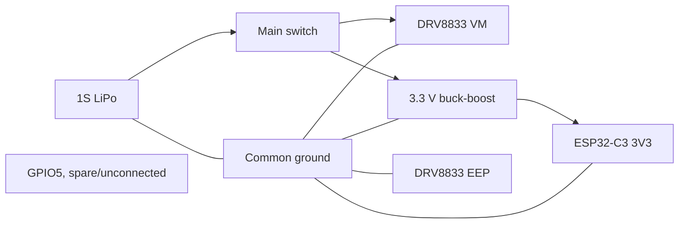
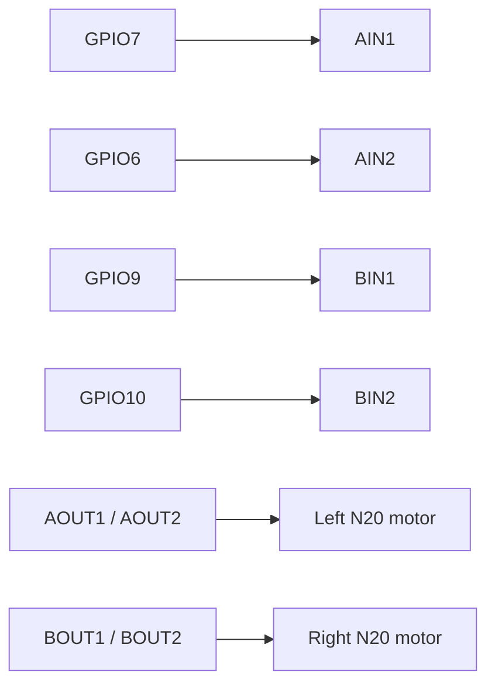

# Antweight controller v2 wiring

## Power and enable path

This DRV8833 breakout has no `nSLEEP` pin, so the driver is always enabled once `VM` is powered. `GPIO5` is left spare/unconnected. Motor safety on reset/link-loss still relies on firmware zeroing the PWM/digital motor outputs (`stopMotors()`), independent of any sleep pin.

## Motor signal path

## ESP32 signal breakout rows J8 and J9

J8 is an unpopulated 1x5 GPIO row and J9 is an unpopulated 1x8 signal row. Both sit exactly one 2.54 mm step outside their matching ESP32 socket pads. The duplicated `3V3` and `GND` pads were removed from beside the ESP32 and moved to J10.

J10 sits below the DRV8833 between both motor connectors and exposes `3V3`, `GND` and `VBAT_SW`. `VBAT_SW` follows the 1S battery and can reach 4.2 V. Use GPIOs only for logic-level loads; LEDs, speakers, relays, solenoids and other actuators that exceed GPIO limits require a resistor or transistor/MOSFET driver and flyback protection where applicable.

GPIO2, GPIO8 and GPIO9 are ESP32-C3 strapping pins and must not be biased incorrectly during reset. GPIO6, GPIO7, GPIO9 and GPIO10 are already used by the motor driver, so attached hardware must not contend with those outputs. `GPIO5` is spare/unconnected on this DRV8833 breakout.

## Assembly and test order

1. Verify the exact ESP32-C3 and DRV8833 breakout pin orders against the v2 pin contracts.
2. Fit power connectors, switch, capacitors and regulator. Tie the DRV8833 `EEP` pad to `GND`.
3. With both modules removed, check for shorts and verify switched battery voltage only reaches VM and regulator input.
4. Fit the regulator and verify 3.3 V before inserting the ESP32-C3.
5. Fit the ESP32-C3 without the motor driver. Configure the transmitter MAC and verify the motor input GPIOs (6, 7, 9, 10) remain low during reset.
6. Fit the DRV8833 without motors. Verify all four input signals and the 200 ms link-loss response. This breakout has no `nSLEEP` to verify; confirm instead that `stopMotors()` zeroes all motor outputs on link loss and reset.
7. Connect motors with wheels raised. Measure peak current and check driver/regulator temperatures.
8. Repeat power-cycle, transmitter-loss and receiver-reset tests before arena use.

## Safety requirements

- Use a protected 1S LiPo or add a separate undervoltage cutoff; firmware v2 does not measure battery voltage.
- Add 100 nF suppression directly across each motor's terminals.
- Select battery connector, switch, traces and driver for the measured combined stall current, not nominal running current.
- Keep the antenna end of the ESP32-C3 outside copper, motor wiring and the battery shadow.
- Disconnect the battery before changing motor wiring.
