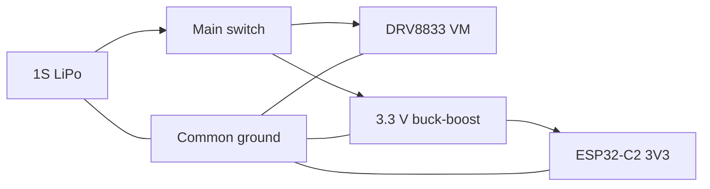
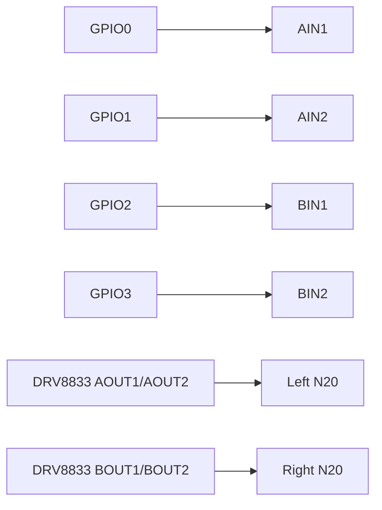

# Antweight controller wiring

## Power path

## Signal path

## Assembly order

1. Verify connector polarity and both module pinouts with a multimeter.
2. Fit the switch, JST connectors, capacitors and regulator header.
3. With controller and driver removed, verify that switched battery voltage reaches regulator input and driver VM only.
4. Fit the regulator and verify `3V3` before inserting the ESP32 module.
5. Fit the ESP32, flash firmware and verify all four outputs without the driver installed.
6. Fit the DRV8833, connect motors and test with wheels raised from the bench.

## Safety checks

- Never charge the LiPo through this carrierboard.
- Insulate the battery and prevent puncture or crushing.
- The main switch must be reachable without approaching moving parts.
- Disconnect the battery before changing motor wiring.